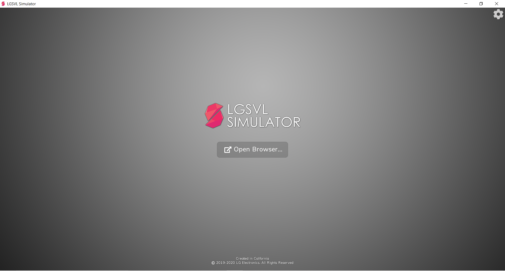
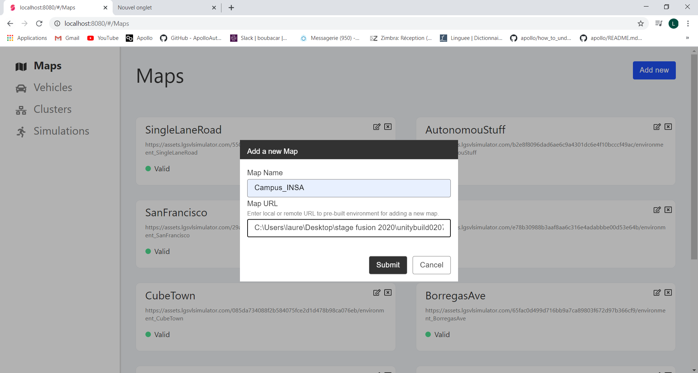
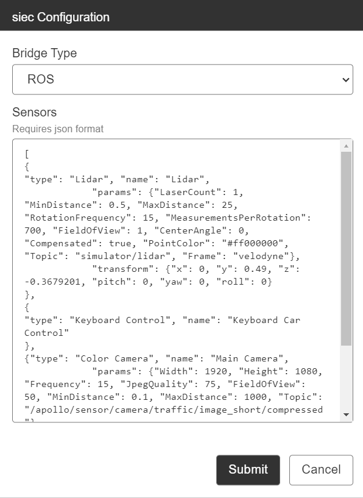
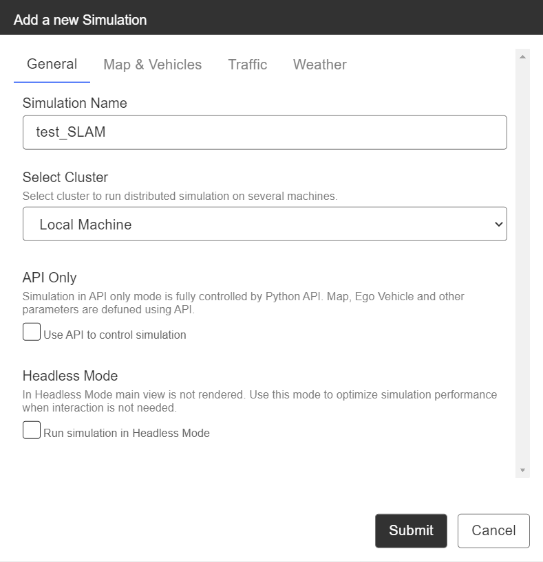
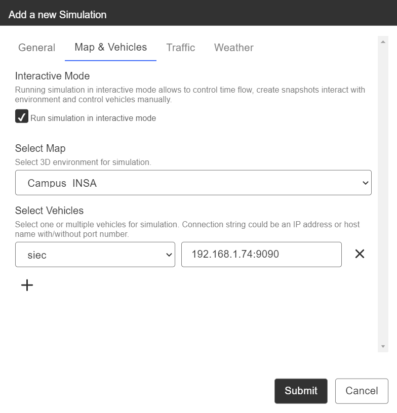
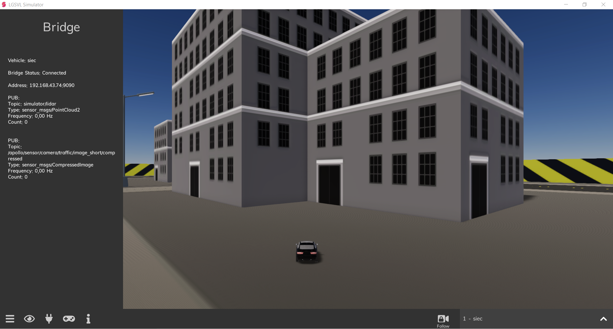
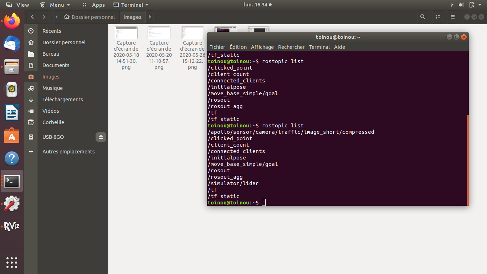
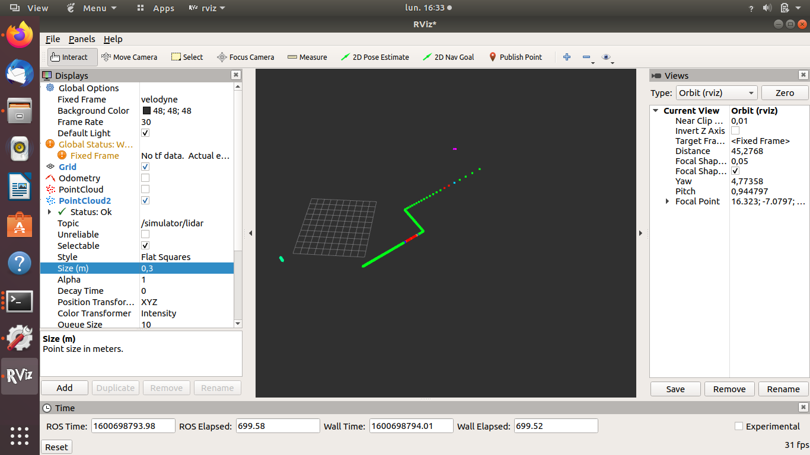

# simulateur_lgsvl_5SIEC

Ce repo à pour but d'expliquer l'installation et l'utilisation du simulateur [lgsvl](https://www.lgsvlsimulator.com/docs/) adapté pour les voitures de 5SIEC.


## Procédure d'installation: 

1. Télécharger l'archive correspondante à votre système d'exploitation: 
2. Décompressez la:
3. Lancez l'éxécutable: 
4. Cliquez sur "open in browser"


5. Une page web s'ouvre et vous arrivez diretement au menu d'import de carte. Sélectionner "ADD NEW".
 - Pour la carte de l'INSA: donner lui un nom ex:"campus INSA" et entrer le chemin que doit utiliser le simulateur pour trouver votre carte:   "VOTRE_CHEMIN_PERSONEL\unitybuild02092020\AssetBundles\Environments\environment_Campus_INSA", puis cliquer sur "Submit".
 - Pour une carte LGSVL: donner lui un nom et entrer un lien vers la carte, ex: 
   - Cube town: https://assets.lgsvlsimulator.com/085da734088f2b584075fce2d1d478b98ca076eb/environment_CubeTown 
   - San Francisco: https://assets.lgsvlsimulator.com/29a5d0d9ef094a4b3e333b28eb48254b9f9ef7a1/environment_SanFrancisco


6. Cliquer maintenant sur "vehicles" dans le menu sur la gauche de votre écran et procédez de la même façon pour ajouter la voiture SIEC, vous le trouverez à "VOTRE_CHEMIN_PERSONEL\unitybuild02092020\AssetBundles\Vehicles\vehicle_voiture_siec", ou encore la jaguar de LGSVL à https://assets.lgsvlsimulator.com/d49c88a93b11b047a3e21e0c7d4b2ec6964fb16d/vehicle_Jaguar2015XE

7. Editez le JSON du vehicle pour y ajouter les capteurs en cliquant sur la clé. Sélectionner "ROS" pour le type de pont, et copier le contenue du fichier config_sensor_siec dans le champs sensors. Cela va ajouter un lidar 2D et une camera à la voiture, ainsi qu'un moyen de la controler. Plus d'option pour le réglage de capteurs peuvent être explorées [ici](https://www.lgsvlsimulator.com/docs/sensor-json-options/). Une fois cela fait, cliquez sur submit.


8. Vous avez terminez la procédure d'installation.

## Lancement de la simulation: 

1. Cliquez sur l'onglet simulation dans le menu à gauche de votre écran.
2. Cliquez sur "add new"
3. Dans l'onglet général, donnez un nom à la simulation.


4. Dans l'onglet map et vehicles, cocher "RUN simulation in interractive mode", sélectionner la carte et la voiture à utiliser pour la simulation. Comme notre voiture dispose d'un pont ROS, il nous faut rentrer son adresse.
 - Si vous faite tourner votre ROS sur la même machine que votre simulateur, rentrer pour adresse "localhost:9090".
 - Si votre ROS tourne sur une autre machine, rentrer pour adresse l'ip de la machine suivi du port 9090 ex: "192.168.4.65:9090"


5. Ignorer les autres onglets pour le moment, comme la simulation tourne en mode interactif, ces paramètres seront modifiables en cours de simulation.
6. Cliquer sur "Submit". Votre simulation est prète.
7. Cliquer sur votre simulation une fois, puis sur l'iconne lecture. 
8. Revenez sur la fenètre du simulateur et piloter votre voiture avec les flèches de votre clavier!

##  Fonctionnement avec ROS

Ce simulateur est conçu pour fonctionner avec le Robot Operating System ou ROS, la distribution [Melodic](http://wiki.ros.org/melodic/Installation/Ubuntu) de ROS est conseillée. ROS est un middleware qui gère les échanges entrent différent programmes appelés noeuds. Les informations échangé par ces noeuds peuvrent être d'une multitude de types/format différents et sont appelés topics. Chaque noeuds peux partagé des informations en publiant des topics, et recevoir des informations en souscrivant aux topics d'autres noeuds. 

### Communication avec ROS

La communication entre le simulateur et votre system ROS se fait par l'intermédiaire d'un websocket qui doit être lancé par votre PC hote (celui qui fait tourné ROS si différent de celui utilisé pour le simulateur). Pour mettre en place ce websocket il vous faudrat installer le package [rosbridge_server](http://wiki.ros.org/rosbridge_suite/Tutorials/RunningRosbridge):
```
sudo apt-get install ros-melodic-rosbridge-suite
```

### Vérification

En éditant le fichier JSON de votre voiture vous avez ajouter différent capteur tel que le lidar par example. Ce lidar va publier un topic de type [POINTCLOUD2](http://docs.ros.org/melodic/api/sensor_msgs/html/msg/PointCloud2.html) appelé "simulator/lidar". Pour vérifier que tout fonctionne bien, nous allons essayer d'observer un topic publier par le simulateur via un visionneur ros appelé [RVIZ](http://wiki.ros.org/rviz). 

1. RVIZ est probablement déjà installer sur votre système car compris dans l'installation de ROS desktop mais vérifier en essayant de la lancer, sinon installé le.
Pour lancer RVIZ, démarrer ROS:
```
roscore
```
Puis dans un autre terminal RVIZ:
```
rviz
```
2. Dans un autre terminal, lancer votre websocket pour la communication simulateur <==> ROS.
```
roslaunch rosbridge_server rosbridge_websocket.launch
``` 

3. Lancer votre simulation via l'interface du simulateur LGSVL. Attention à l'adresse du pont de communication cf "lancement simulation 4".
   


4. Vérifiez la connection:
 - via le simulateur en cliquant sur l'icone "prise" en bas de l'écran, le status doit être "connected"
 - via ROS en ouvrant un terminal et en vérifiant par exemple que le topic 'simulator/lidar" est publié. Pour afficher la liste des topics échangées taper:
   ```
   rostopic list
   ```


5. Paramétrez RVIZ:
 - Retourer sur l'interface de RVIZ et ajouter un nouveau topic de type pointcloud2.
 - Dans les paramètres de ce nouveau topic, sélectionner topic name et cliquez sur simulator/lidar
 - Dans le menu global option, taper "velodyne" pour fixed frame.


7. Déplacer votre voiture et observer le scan lidar évoluer.

## Dévellopement 

### Créer une nouvelle carte/véhicule pour LGSVL

### Créer un mesh unity à partir d'un environnement réel

#### Création d'un nuage de point coloré
#### Edition via MeshLAB
#### Intégration au simulateur via unity


